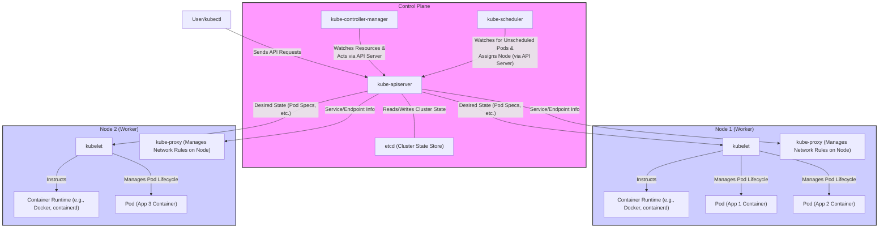
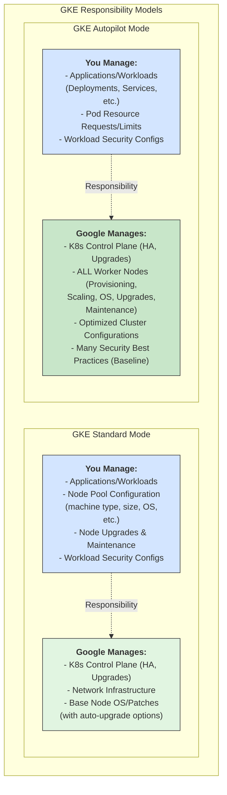
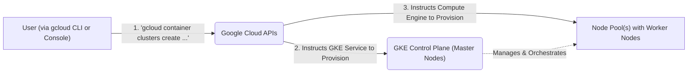
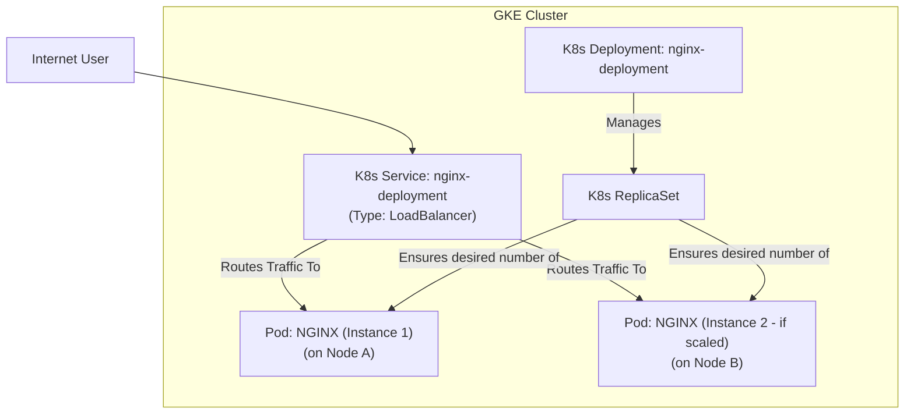
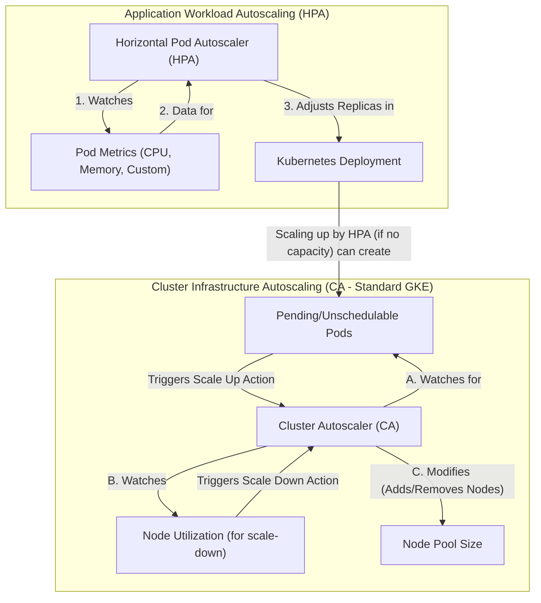
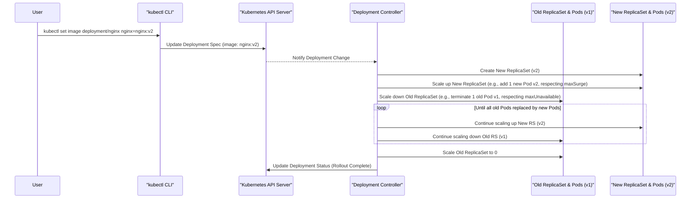
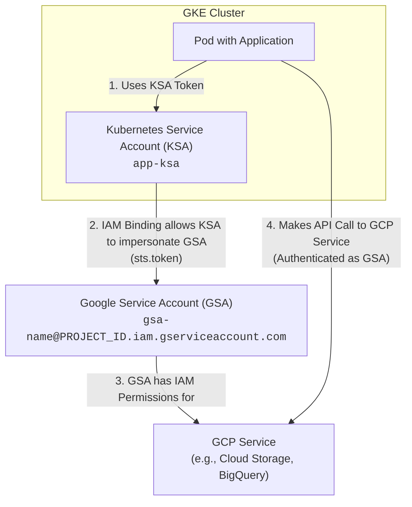
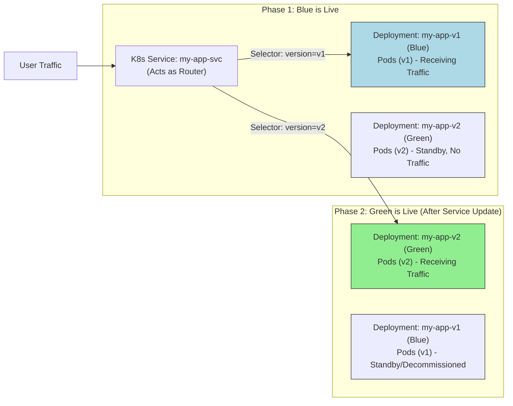

Kubernetes has revolutionized how we manage containerized applications, establishing itself as the de facto standard for orchestration. Google Cloud Platform (GCP) offers a powerful, managed Kubernetes service called Google Kubernetes Engine (GKE), which simplifies cluster operations and integrates seamlessly with the GCP ecosystem. This guide will walk you through leveraging Kubernetes on Google Cloud, from understanding core concepts and initial setup to advanced deployment strategies and operational best practices, ensuring your applications are scalable, resilient, and efficiently managed.

### Understanding Core Concepts: Kubernetes and GKE

Before diving into GKE, let's clarify what Kubernetes is and how GKE builds upon it.

#### Kubernetes: The Container Orchestrator

Kubernetes (often abbreviated as K8s) is an open-source platform designed to automate the deployment, scaling, and management of containerized applications. It groups containers that make up an application into logical units for easy management and discovery.

**Key Kubernetes Components:**

*   **Control Plane:** The brain of the cluster. It manages worker nodes and Pods in the cluster. Components include:
    *   `kube-apiserver`: Exposes the Kubernetes API.
    *   `etcd`: Consistent and highly-available key-value store used as Kubernetes' backing store for all cluster data.
    *   `kube-scheduler`: Watches for newly created Pods with no assigned node and selects a node for them to run on.
    *   `kube-controller-manager`: Runs controller processes.
*   **Nodes (Worker Machines):** VMs or physical machines where your containerized applications run. Each node contains:
    *   `kubelet`: An agent that runs on each node. It makes sure that containers are running in a Pod.
    *   `kube-proxy`: A network proxy that runs on each node, implementing part of the Kubernetes Service concept.
    *   Container Runtime: Software responsible for running containers (e.g., Docker, containerd).
*   **Pods:** The smallest deployable units of computing that you can create and manage in Kubernetes. A Pod represents a single instance of a running process in your cluster and can contain one or more containers.
*   **Services:** An abstract way to expose an application running on a set of Pods as a network service.
*   **Deployments:** Provides declarative updates for Pods and ReplicaSets (which ensure a specified number of Pod replicas are running).



#### Google Kubernetes Engine (GKE): Managed Kubernetes on GCP

GKE is Google Cloud’s managed Kubernetes service. It reduces operational overhead by handling much of the cluster management lifecycle, including provisioning, scaling, upgrades, and maintenance of the control plane and, optionally, nodes.

**Key Benefits of Using GKE:**

*   **Managed Infrastructure**: Google manages the Kubernetes control plane (master nodes), ensuring high availability and reliability. For GKE Autopilot clusters, Google also manages the worker nodes.
*   **Seamless Integration**: Native integration with Google Cloud services like Artifact Registry (for container images), Cloud Monitoring, Cloud Logging, Identity and Access Management (IAM), Virtual Private Cloud (VPC), Cloud Storage, Pub/Sub, and BigQuery.
*   **Scalability & Auto-Scaling**: Effortlessly scale your applications and cluster infrastructure. GKE supports cluster autoscaling (adding/removing nodes) and horizontal/vertical pod autoscaling.
*   **Enhanced Security**: Built-in security features, including IAM for fine-grained access control, Workload Identity for secure access to GCP services from Pods, private clusters for network isolation, Shielded GKE Nodes, and Binary Authorization.
*   **Cost Efficiency**: Features like preemptible VMs (Spot VMs in GKE), committed use discounts, and Autopilot mode (pay per pod resource usage) help optimize costs.
*   **Multiple Cluster Modes**:
    *   **Standard Mode**: You manage the worker nodes and have full configuration flexibility.
    *   **Autopilot Mode**: GKE manages the control plane and worker nodes, offering a hands-off, optimized, and more secure experience. You only define your workloads and pay for the resources they request.



### Setting Up Your First GKE Cluster on GCP

To get started, you'll need a Google Cloud account with billing enabled and the `gcloud` command-line interface (CLI) installed and configured.

**Prerequisites:**

1.  **Google Cloud Account**: Sign up if you don't have one.
2.  **Billing Enabled**: Ensure billing is active for your project.
3.  **`gcloud` CLI**: [Install and initialize the Google Cloud CLI](https://cloud.google.com/sdk/docs/install).
4.  **Enable APIs**: Enable the Kubernetes Engine API and Compute Engine API for your project:
    ```bash
    gcloud services enable container.googleapis.com compute.googleapis.com
    ```

#### 1. Configure `gcloud` Defaults

Set your default project and compute zone (choose a region/zone near you or your users):

```bash
gcloud config set project <YOUR_PROJECT_ID>
gcloud config set compute/zone us-central1-a # Example zone
```

#### 2. Create a GKE Cluster

You can create a Standard cluster or an Autopilot cluster.

**Option A: Create a GKE Standard Cluster**
This command creates a regional Standard cluster with 3 nodes per zone in the specified region, providing higher availability.

```bash
gcloud container clusters create my-gke-cluster \
    --region us-central1 \
    --num-nodes=1 \
    --machine-type=e2-medium \
    --release-channel=regular
```
*   `--region`: Creates a regional cluster (control plane replicated across 3 zones).
*   `--num-nodes`: Number of nodes *per zone* in the region.
*   `--machine-type`: Specifies the VM type for nodes.
*   `--release-channel`: Subscribes to automatic upgrades (rapid, regular, stable). Recommended.

**Option B: Create a GKE Autopilot Cluster**
Autopilot simplifies operations significantly.

```bash
gcloud container clusters create-auto my-autopilot-cluster \
    --region us-central1
```



#### 3. Get Cluster Credentials

After the cluster is created, configure `kubectl` to connect to it:

```bash
# For Standard cluster:
gcloud container clusters get-credentials my-gke-cluster --region us-central1

# For Autopilot cluster:
gcloud container clusters get-credentials my-autopilot-cluster --region us-central1
```
This command updates your `~/.kube/config` file.

Verify connectivity:
```bash
kubectl get nodes
```

#### 4. Deploying a Containerized Application

Let’s deploy a simple NGINX web server.

Create a Kubernetes Deployment:
A Deployment manages a set of replicated Pods.

```bash
kubectl create deployment nginx-deployment --image=nginx:latest
```
This command tells Kubernetes to:
1.  Pull the `nginx:latest` image (from Docker Hub by default).
2.  Create Pods running this image.
3.  Ensure one replica of the Pod is running (default for `create deployment`).

Expose the Deployment with a Service:
To access the NGINX application from the internet, you need to expose it using a Service of type `LoadBalancer`.

```bash
kubectl expose deployment nginx-deployment --port=80 --type=LoadBalancer
```
*   `--port=80`: The port the Service will listen on.
*   `--type=LoadBalancer`: GKE will provision a Google Cloud Network Load Balancer.

Check the external IP:
It might take a minute or two for the external IP to be assigned.

```bash
kubectl get services nginx-deployment
```
Output will look like:
```
NAME               TYPE           CLUSTER-IP    EXTERNAL-IP     PORT(S)        AGE
nginx-deployment   LoadBalancer   10.X.X.X      35.X.X.X        80:3XYZW/TCP   60s
```
Once the `EXTERNAL-IP` is assigned, you can access your NGINX server by navigating to `http://<EXTERNAL-IP>` in your browser.



### Advanced Features and Best Practices

#### Auto-Scaling Your Workloads and Cluster

GKE provides powerful autoscaling capabilities:

1.  **Horizontal Pod Autoscaler (HPA):** Automatically scales the number of Pods in a deployment or replica set based on observed CPU utilization or other custom metrics.
    ```bash
    # Example: Autoscale 'nginx-deployment' to maintain 50% CPU utilization,
    # with a minimum of 1 Pod and a maximum of 5 Pods.
    kubectl autoscale deployment nginx-deployment --cpu-percent=50 --min=1 --max=5
    ```

2.  **Vertical Pod Autoscaler (VPA):** (More common in Standard mode, Autopilot handles this intrinsically) Adjusts the CPU and memory requests for Pods, optimizing resource allocation.

3.  **Cluster Autoscaler (CA):** (For Standard GKE) Automatically resizes your cluster's node pools. If HPA needs more Pods but there aren't enough resources on existing nodes, CA provisions new nodes. If nodes are underutilized, CA can remove them.
    *   Enabled by default in Autopilot.
    *   For Standard, enable during cluster creation or update:
        ```bash
        gcloud container clusters update my-gke-cluster --enable-autoscaling \
            --min-nodes=1 --max-nodes=5 --region us-central1 --node-pool=default-pool
        ```



#### Rolling Updates and Rollbacks

Kubernetes allows you to update your applications with zero downtime using rolling updates.

**Performing a Rolling Update:**
Update the image for your `nginx-deployment`:
```bash
kubectl set image deployment/nginx-deployment nginx=nginx:1.25.3 # Assuming 1.25.3 is newer
```
Kubernetes will gradually replace old Pods with new ones, ensuring a minimum number of Pods are always available.

**Monitoring Rollout Status:**
```bash
kubectl rollout status deployment/nginx-deployment
```

**Rolling Back to a Previous Version:**
If the new version has issues, you can quickly roll back:
```bash
kubectl rollout undo deployment/nginx-deployment
```
To roll back to a specific revision:
```bash
kubectl rollout history deployment/nginx-deployment
kubectl rollout undo deployment/nginx-deployment --to-revision=<REVISION_NUMBER>
```



#### Integrating with Other Google Cloud Services

GKE workloads often need to interact with other GCP services.

1.  **Persistent Storage with PersistentVolumeClaims (PVCs) and Persistent Disks:**
    For stateful applications, you can use GCP Persistent Disks.
    ```yaml
    # persistent-volume-claim.yaml
    apiVersion: v1
    kind: PersistentVolumeClaim
    metadata:
      name: my-app-pvc
    spec:
      accessModes:
        - ReadWriteOnce # Can be mounted by a single node
      resources:
        requests:
          storage: 10Gi # Request 10 GB of storage
      storageClassName: standard-rwo # For regional PD, use premium-rwo; for zonal, use standard or premium
    ```
    Apply it: `kubectl apply -f persistent-volume-claim.yaml`
    Then mount this PVC in your Pod's `volumeMounts` and `volumes` sections. GKE will dynamically provision a Persistent Disk.

2.  **Accessing Cloud Storage (GCS) Buckets:**
    *   **Using `gcsfuse` Sidecar (older method) or GCS FUSE CSI Driver (recommended):** The CSI driver allows you to mount GCS buckets as volumes directly in your Pods. This is more idiomatic for Kubernetes.
        *   You'll need to install the [Cloud Storage FUSE CSI driver](https://cloud.google.com/kubernetes-engine/docs/how-to/persistent-volumes/cloud-storage-fuse-csi-driver) in your cluster.
        *   Then, define a PersistentVolume and PersistentVolumeClaim referencing the CSI driver and your bucket.
    *   **Using Client Libraries:** Applications can use GCP client libraries (e.g., for Go, Python, Java) with Workload Identity to authenticate and access GCS buckets directly.

3.  **Workload Identity (Recommended for GCP Service Access):**
    Securely grant Kubernetes service accounts (KSAs) in your GKE cluster the ability to act as Google service accounts (GSAs). This avoids needing to manage service account keys.
    *   **Steps:**
        1.  Create a GSA with necessary IAM permissions (e.g., Cloud Storage Object Viewer).
        2.  Create a KSA in your GKE cluster.
        3.  Bind the GSA to the KSA using an IAM policy binding.
        4.  Annotate your KSA with the GSA's email.
        5.  Specify the KSA in your Pod specification (`serviceAccountName`).



#### Security Best Practices

*   **Principle of Least Privilege**: Grant only necessary IAM roles to GSAs and RBAC permissions to KSAs.
*   **Enable Private Clusters**: Restrict public IP addresses for nodes and limit control plane endpoint access.
*   **Use Network Policies**: Control pod-to-pod communication within the cluster. Deny all by default and allow specific traffic flows.
*   **Regularly Update Clusters and Node Pools**: GKE release channels help automate this.
*   **Use Shielded GKE Nodes**: Provides verifiable integrity of your nodes.
*   **Binary Authorization**: Enforce that only trusted container images are deployed on GKE.
*   **Manage Secrets Securely**: Use Kubernetes Secrets, potentially integrated with Google Secret Manager for enhanced security.
*   **Scan Container Images**: Use Artifact Analysis in Artifact Registry or Google Container Registry to scan for vulnerabilities.

### Monitoring and Logging with Cloud Operations

GKE integrates seamlessly with Google Cloud's operations suite (formerly Stackdriver) for comprehensive monitoring and logging.

*   **Cloud Monitoring**:
    *   Collects metrics, events, and metadata from GKE clusters, Pods, and containers.
    *   Provides dashboards to visualize performance and health.
    *   Allows setting up alerting policies for critical conditions.
    *   By default, system metrics are collected. You can enable control plane metrics and configure application-specific metrics collection (e.g., with Prometheus).
*   **Cloud Logging**:
    *   Collects logs from your GKE cluster components and your applications running in Pods.
    *   Logs are automatically collected for `stdout` and `stderr` from containers.
    *   Provides powerful querying, analysis, and log-based metrics.

You can access these tools directly from the Google Cloud Console under the "Kubernetes Engine", "Monitoring", and "Logging" sections.

### Real-World Example: Blue-Green Deployment Strategy

A blue-green deployment strategy minimizes downtime and risk by running two identical environments ("blue" for current, "green" for new) and switching traffic from blue to green once the new version is verified.

**Simplified Approach:**

1.  **Current State (Blue):** You have `my-app-v1` (Deployment) exposed via a Service `my-app-svc` that selects Pods with `app: my-app, version: v1`.
    ```yaml
    # service.yaml (initial)
    apiVersion: v1
    kind: Service
    metadata:
      name: my-app-svc
    spec:
      selector:
        app: my-app
        version: v1 # Points to blue
      ports:
        - protocol: TCP
          port: 80
          targetPort: 8080
      type: LoadBalancer
    ```

2.  **Deploy New Version (Green):** Deploy `my-app-v2` (Deployment) with Pods labeled `app: my-app, version: v2`. At this point, it doesn't receive live traffic.
    ```bash
    # Example: kubectl apply -f deployment-v2.yaml
    # (deployment-v2.yaml has labels app: my-app, version: v2)
    ```

3.  **Switch Traffic (Service Update):** Update the Service `my-app-svc` to select Pods with `version: v2`.
    ```bash
    # Update service.yaml or use kubectl patch
    kubectl patch service my-app-svc -p '{"spec":{"selector":{"version":"v2"}}}'
    ```
    Now `my-app-svc` directs traffic to `my-app-v2`.

4.  **Monitor Green:** Thoroughly test and monitor the `v2` application.

5.  **Decommission Blue (Optional/Later):** If `v2` is stable, you can scale down or delete the `my-app-v1` Deployment. If issues arise with `v2`, you can quickly roll back by patching the service selector back to `version: v1`.


*Note: More sophisticated blue-green or canary deployments often involve traffic splitting using tools like Istio, Linkerd, or Ingress controllers.*

Kubernetes on Google Cloud, through GKE, offers a powerful and flexible platform for modern application delivery. By leveraging GKE's managed capabilities, robust security features, seamless integration with the GCP ecosystem, and by following operational best practices, development teams can build, deploy, and scale applications with greater speed, confidence, and efficiency.

This guide provides a solid foundation. To continue your journey:

*   Explore **GKE Autopilot** for a more hands-off experience.
*   Dive deeper into **Workload Identity** for secure GCP service access.
*   Learn about **Network Policies** for fine-grained traffic control.
*   Integrate GKE into your **CI/CD pipelines** using Cloud Build, Jenkins, GitLab CI, or GitHub Actions.
*   Investigate **service meshes** like Istio or Anthos Service Mesh for advanced traffic management, observability, and security for microservices.

For more details, always refer to the official [GKE documentation](https://cloud.google.com/kubernetes-engine/docs) and start experimenting with your own clusters and applications today.