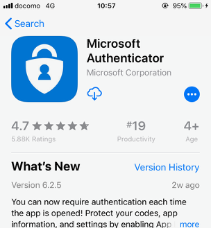
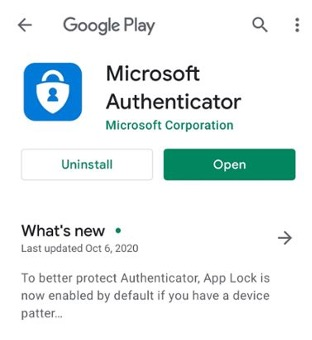

## How to Enable Multi-Factor Authentication using Microsoft Authenticator App for Office 365 Accounts

### What is Multi-Factor Authentication (MFA)?

Multi-Factor Authentication (MFA), also known as Two-Factor Authentication (2FA), is a security feature that provides an additional layer of protection for your online accounts. Think of it as adding a second lock to your front door—even if someone has your key (password), they still can't get in without the second key (verification code).

**Why is MFA important?**
- 🔒 It significantly reduces the risk of unauthorized access to your accounts
- 🛡️ Even if your password is compromised, hackers still need the second factor to gain access
- 📱 The second factor is typically something only you physically possess (like your phone)
- ⚠️ According to Microsoft, MFA can block over 99.9% of account compromise attacks

### What You'll Need
- An Office 365 account
- A smartphone (iOS or Android)
- Internet connection
- 5-10 minutes of your time

### Overview of the Process

Setting up MFA with Microsoft Authenticator involves four simple steps:

1. Download and install the Microsoft Authenticator app on your phone
2. Configure your Office 365 account to use the Authenticator app
3. Link your account to the app by scanning a QR code
4. Set up a backup verification method (just in case)

Let's walk through each step in detail:

### Step 1: Download and install the Microsoft Authenticator App

**For iPhone users:**
- Open the App Store on your iPhone
- Tap the Search tab at the bottom right
- Type "Microsoft Authenticator" in the search bar
- Look for the app with the official Microsoft Corporation publisher
- Tap "Get" or the download icon (cloud with arrow)
- Authenticate with Face ID, Touch ID, or your Apple ID password if prompted
- Wait for the app to download and install

**For Android users:**
- Open the Google Play Store on your Android device
- Tap the Search bar at the top
- Type "Microsoft Authenticator" in the search bar
- Look for the app with the official Microsoft Corporation publisher
- Tap "Install"
- Wait for the app to download and install

**After installation:**
- Locate and open the Microsoft Authenticator app on your device
- Tap "Accept" when prompted to accept the terms of use and privacy policy
- You may be asked to allow notifications—tap "Allow" (this is important for receiving authentication prompts)

  

    
    
Microsoft Authenticator on iOS

  

  

    
    
Microsoft Authenticator on Android

  

> **Tip**: Make sure to place the Microsoft Authenticator app on your home screen for easy access. You'll be using it frequently when signing in to your accounts.

### Step 2: Set up Microsoft Authenticator App as your verification method

**On your computer (not your phone):**

1. **Access your Office 365 account**:
   - Open a web browser (like Chrome, Edge, Safari, or Firefox)
   - Go to [portal.office.com](https://portal.office.com)
   - Sign in with your Office 365 email address and password

2. **Navigate to security settings**:
   - If you see a message saying "More information required" or "Set up your account", you're in the right place—click "Next" or "Set it up now"
   - If you don't see these messages, manually go to the MFA setup page by typing [https://aka.ms/mfasetup](https://aka.ms/mfasetup) in your browser address bar

3. **Access security info settings**:
   - You should now be on a page titled "Security info"
   - Look for the "+ Add sign-in method" or "+ Add method" button and click it

4. **Select Authenticator app**:
   - A dropdown menu will appear with different verification methods
   - Select "Authenticator app" from the list
   - A new screen will appear with setup options

5. **Choose notification method**:
   - You'll see two options:
     - "Receive notifications for verification" (recommended for beginners)
     - "Use verification code"
   - Make sure the first option is selected (it's usually the default)

6. **Start the setup process**:
   - Click the "Set up" button to proceed
   - The next screen will display a QR code—**don't close this window!**
   - You'll need to keep this screen open while completing the next step on your phone

> **Note**: If you're setting this up on a work computer, you might need administrator permissions. If you encounter any issues, contact your IT support team.

### Step 3: Scan the QR code to link your app to your account

**Now, pick up your phone** with the Microsoft Authenticator app installed. You'll need to use both your computer and phone for this step.

  
Important:

  
Keep the QR code displayed on your computer screen while completing these steps on your phone.

**On your phone:**

1. **Open the Microsoft Authenticator app** you installed in Step 1

2. **Add your account**:
   - Tap the **+** (plus) icon in the upper-right corner of the app
   - Select **Work or school account** from the menu
   - You may see a prompt asking for camera access—tap **Allow** (this is necessary to scan the QR code)

3. **Scan the QR code**:
   - Point your phone's camera at the QR code displayed on your computer screen
   - Hold the phone steady until the app recognizes the code (you don't need to take a picture)
   - The app will automatically detect the QR code when properly aligned

4. **Complete the connection**:
   - After successfully scanning the QR code, your account will be added to the Authenticator app
   - You'll see your account email address appear in the app

5. **Test the connection**:
   - Return to your computer and click **Next**
   - A test notification will be sent to your phone
   - On your phone, you'll see a notification asking you to approve the sign-in
   - Tap **Approve** on your phone

6. **Verify success**:
   - On your computer, you should see a message saying "Your configuration was successful"
   - Click **Next** to continue

> **Troubleshooting**: If the QR code scan doesn't work, most setup screens offer a manual entry option with a code you can type into the app instead of scanning.

### Step 4: Add your phone number as a backup option

**Why this step matters**: Adding a backup verification method ensures you can still access your account if you lose your phone or can't use the Authenticator app for any reason. This is a critical step that many people skip—don't make that mistake!

**On your computer:**

1. **Enter your backup phone number**:
   - After completing the Authenticator app setup, you'll be prompted to add a backup method
   - Select **Phone** as your backup method if it's not already selected
   - Enter your complete mobile phone number, including the country code (e.g., +1 for USA, +44 for UK)
   - Select whether you want to receive verification codes via **text message** (recommended) or **phone call**

2. **Verify your phone number**:
   - Click **Next** to proceed
   - Within a few moments, you'll receive a text message with a 6-digit verification code on your phone
   - Check your text messages and note the verification code
   - Enter this code in the verification field on your computer
   - Click **Verify** to confirm

3. **Complete the setup**:
   - After successful verification, you'll see a confirmation message
   - Click **Done** to finish the setup process

  
Pro Tip:

  
Consider adding more than one backup method if possible. You can add additional methods later by returning to the Security info page at <a href="https://aka.ms/mfasetup" className="text-blue-600 hover:underline">https://aka.ms/mfasetup</a>.

### How to Use MFA After Setup

Now that you've set up MFA, here's what to expect when signing in to your Office 365 account:

1. **First sign-in factor**: Enter your email and password as usual

2. **Second sign-in factor**: You'll be prompted for additional verification in one of two ways:
   - **Push notification**: Your phone will receive a notification asking you to approve the sign-in
   - **Verification code**: You may be asked to enter a code from the Authenticator app

3. **Approving sign-ins**:
   - When you receive a notification, open it and review the sign-in details
   - Only tap **Approve** if you recognize the sign-in attempt
   - If you didn't try to sign in, tap **Deny** to block the unauthorized access attempt

### Troubleshooting Common Issues

**Lost or new phone?**
- Use your backup phone number verification method to sign in
- Contact your IT administrator if you can't access your account

**Not receiving notifications?**
- Check that notifications are enabled for the Microsoft Authenticator app
- Ensure your phone has an internet connection
- Try opening the app directly to see if there are pending approvals

**App showing incorrect time-based codes?**
- Make sure your phone's date and time settings are set to automatic

### Conclusion

Congratulations! You've successfully enabled Multi-Factor Authentication using the Microsoft Authenticator app for your Office 365 account. Your account is now significantly more secure against unauthorized access attempts.

Remember these key points:
- Always keep your phone secure, as it's now part of your login security
- Set up backup methods to ensure you don't get locked out of your account
- If you receive an unexpected authentication request, always deny it and change your password immediately

By taking this important security step, you've dramatically reduced the risk of your account being compromised, even if your password is exposed in a data breach.

I hope this tutorial was helpful. If you have any questions or need further assistance, please feel free to contact me or leave a comment below.