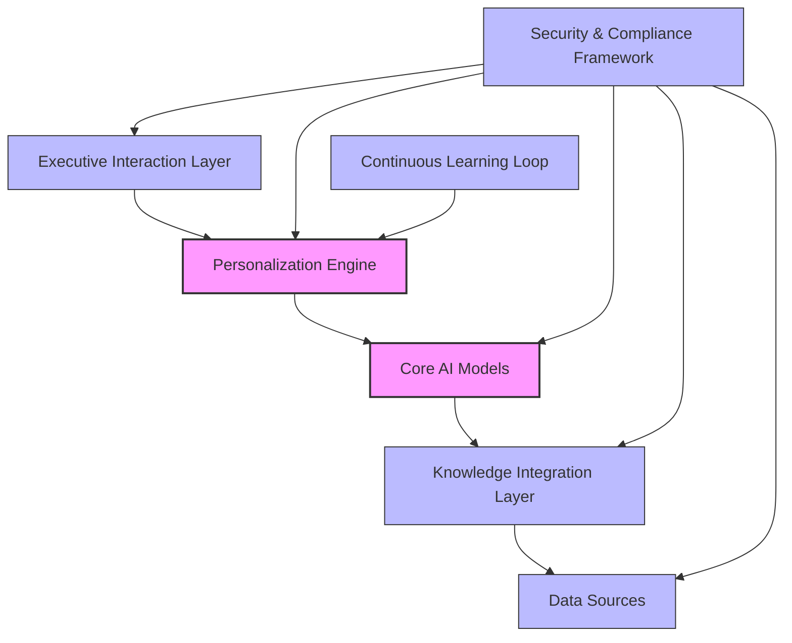
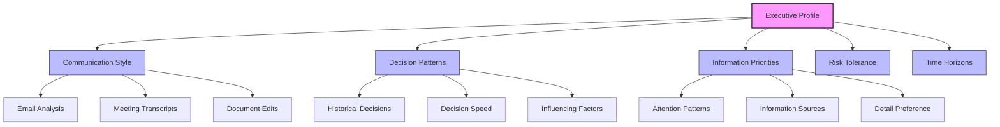
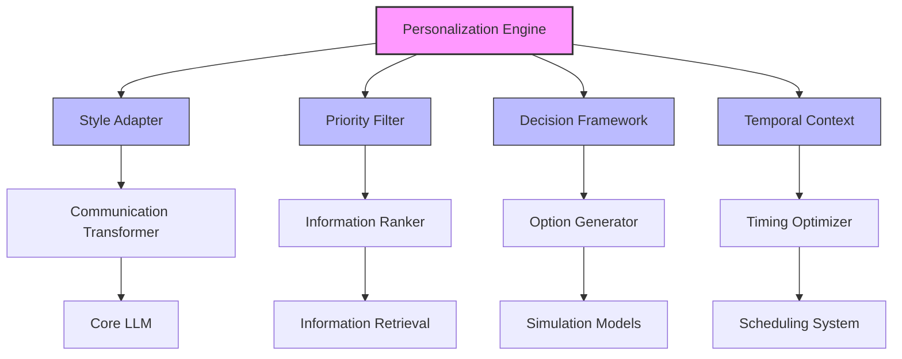
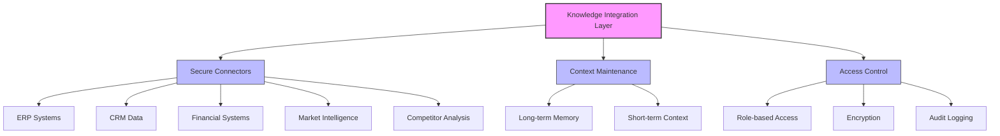
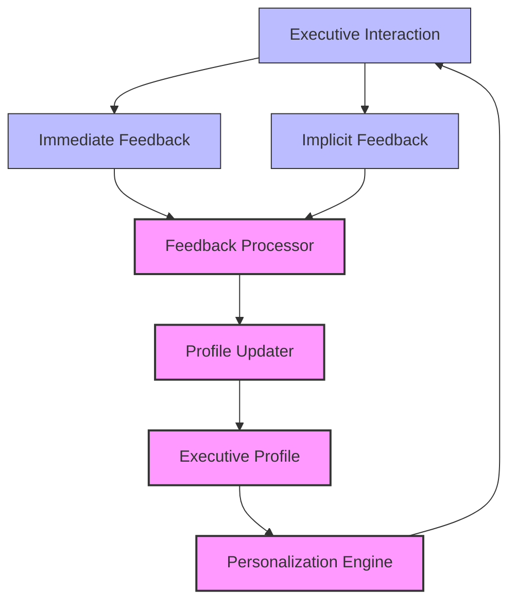
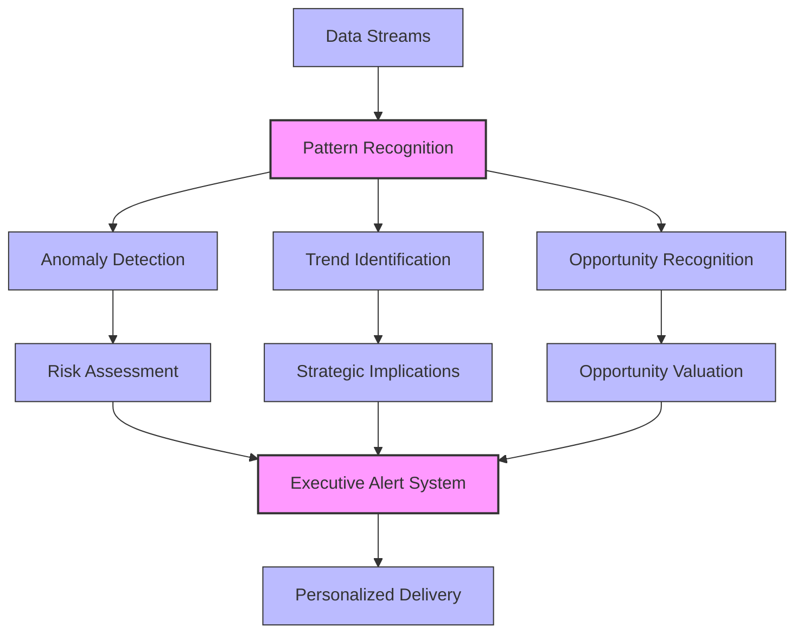
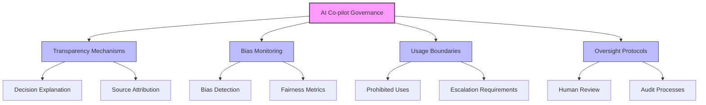

import { Image } from 'astro:assets';

# Symbiotic Workflows: Engineering AI Co-Pilots for Hyper-Personalized Executive Decision Support

**The C-suite of 2026 will rely on AI systems that go beyond generic productivity tools. This tutorial explores how to create truly personalized AI co-pilots that adapt to individual executive styles and needs.**

## Introduction: Beyond Generic AI Assistants

Today's executives face unprecedented complexity in decision-making. The volume of data, speed of market changes, and intricacy of global operations demand cognitive capabilities that even the most talented leaders struggle to maintain consistently.

Generic AI assistants offer limited value in this context. True executive augmentation requires systems that:

1. Deeply understand individual communication preferences
2. Learn decision-making patterns specific to the executive
3. Prioritize information based on personal and organizational values
4. Maintain absolute security and confidentiality
5. Adapt continuously to changing priorities

This tutorial will guide you through creating such systems - what we call **Executive AI Co-pilots**.

## The Architecture of Executive AI Co-pilots

Before diving into implementation, let's understand the architecture of an effective executive co-pilot system:



### Key Components Explained:

1. **Executive Interaction Layer**: The interfaces through which executives interact with the system
2. **Personalization Engine**: The heart of the co-pilot, containing models of executive preferences
3. **Core AI Models**: Foundation models and specialized algorithms for different tasks
4. **Knowledge Integration Layer**: Connects to various data sources while maintaining context
5. **Data Sources**: Internal and external information repositories
6. **Security & Compliance Framework**: Ensures data protection and regulatory adherence
7. **Continuous Learning Loop**: Enables the system to improve through usage

## Step 1: Building the Executive Profile

The foundation of personalization is a comprehensive executive profile. This goes far beyond basic preferences to capture cognitive patterns and decision frameworks.

### Data Collection Strategy



### Implementation Code: Profile Generator

```python
class ExecutiveProfiler:
    def __init__(self, executive_id, security_level="maximum"):
        self.executive_id = executive_id
        self.security_level = security_level
        self.profile = self._initialize_profile()
        self.data_collectors = self._setup_collectors()
        
    def _initialize_profile(self):
        """Create empty profile structure with all necessary categories"""
        return {
            "communication": {
                "formality_level": None,
                "preferred_length": None,
                "vocabulary_complexity": None,
                "response_time_preference": None
            },
            "decision_making": {
                "risk_tolerance": None,
                "data_dependency": None,
                "collaborative_tendency": None,
                "decision_speed": None
            },
            "information_processing": {
                "detail_orientation": None,
                "visual_vs_textual": None,
                "preferred_data_formats": [],
                "context_requirements": None
            }
        }
    
    def _setup_collectors(self):
        """Initialize data collectors based on security level"""
        collectors = []
        if self.security_level == "maximum":
            # On-premise collectors only
            collectors.append(EmailAnalyzer(on_premise=True))
            collectors.append(MeetingAnalyzer(on_premise=True))
        else:
            # Could include cloud services
            collectors.append(EmailAnalyzer(on_premise=False))
            collectors.append(MeetingAnalyzer(on_premise=False))
        
        return collectors
    
    def generate_initial_profile(self, data_sources):
        """Generate initial profile from historical data"""
        for collector in self.data_collectors:
            profile_updates = collector.analyze(data_sources)
            self._update_profile(profile_updates)
        
        return self.profile
    
    def _update_profile(self, updates):
        """Update profile with new insights"""
        # Implementation of profile updating logic
        pass
```

## Step 2: Designing the Personalization Engine

The personalization engine transforms generic AI capabilities into executive-specific tools. It acts as a translation layer between the executive's preferences and the underlying AI models.

### Personalization Architecture



### Key Personalization Functions

1. **Style Adaptation**: Transforms AI outputs to match executive's communication style
2. **Priority Filtering**: Ranks information based on executive's demonstrated interests
3. **Decision Framework Alignment**: Generates options that align with executive's decision patterns
4. **Temporal Context**: Optimizes when to present information based on executive's schedule and habits

## Step 3: Implementing Secure Knowledge Integration

Security is paramount when dealing with executive-level information. The knowledge integration layer must balance accessibility with protection.

### Secure Knowledge Architecture



### Implementation: Secure Data Access

```typescript
class SecureKnowledgeConnector {
  private encryptionKeys: Map<string, CryptoKey>;
  private accessControl: AccessControlList;
  private auditLogger: AuditLogger;
  
  constructor(executiveId: string) {
    this.encryptionKeys = new Map();
    this.accessControl = new AccessControlList(executiveId);
    this.auditLogger = new AuditLogger({
      level: 'detailed',
      retention: '7years',
      tamperProof: true
    });
  }
  
  async connectToDataSource(source: DataSource, query: Query): Promise<EncryptedData> {
    // Verify access permissions
    if (!this.accessControl.canAccess(source, query.scope)) {
      this.auditLogger.logDeniedAccess(source, query);
      throw new AccessDeniedException('Access denied to requested data');
    }
    
    // Log the access attempt
    this.auditLogger.logAccessAttempt(source, query);
    
    // Retrieve data through secure channel
    const rawData = await source.secureQuery(query, this.getAccessToken(source));
    
    // Encrypt data before returning
    const encryptedData = await this.encryptData(rawData);
    
    // Log successful retrieval
    this.auditLogger.logSuccessfulRetrieval(source, query, {
      dataSize: encryptedData.size,
      timestamp: new Date()
    });
    
    return encryptedData;
  }
  
  private async encryptData(data: any): Promise<EncryptedData> {
    // Implementation of data encryption
    // ...
  }
  
  private getAccessToken(source: DataSource): AccessToken {
    // Implementation of token retrieval
    // ...
  }
}
```

## Step 4: Continuous Learning and Adaptation

The most powerful aspect of executive co-pilots is their ability to improve over time. This requires a sophisticated feedback system.

### Learning Loop Visualization



### Types of Feedback

1. **Explicit Feedback**: Direct ratings or corrections from the executive
2. **Implicit Feedback**: Derived from executive actions (e.g., ignoring certain information)
3. **Outcome Feedback**: Based on the results of decisions made with co-pilot assistance

## Step 5: Implementing Proactive Intelligence

The most advanced executive co-pilots don't just respond to queries - they proactively identify opportunities and risks.

### Proactive Intelligence Framework



### Implementation: Proactive Alert System

```python
class ProactiveIntelligence:
    def __init__(self, executive_profile, alert_thresholds):
        self.executive_profile = executive_profile
        self.alert_thresholds = alert_thresholds
        self.pattern_recognizers = self._initialize_recognizers()
        
    def _initialize_recognizers(self):
        """Initialize pattern recognition models"""
        return {
            "market_shifts": MarketShiftDetector(
                sensitivity=self.executive_profile.risk_tolerance
            ),
            "competitor_actions": CompetitorActionDetector(
                competitors=self.executive_profile.priority_competitors,
                threshold=self.alert_thresholds.competitor_importance
            ),
            "internal_metrics": InternalMetricMonitor(
                key_metrics=self.executive_profile.priority_metrics,
                variance_threshold=self.alert_thresholds.metric_variance
            ),
            "regulatory_changes": RegulatoryChangeDetector(
                industries=self.executive_profile.regulated_industries,
                regions=self.executive_profile.operating_regions
            )
        }
    
    def process_data_streams(self, data_streams):
        """Process incoming data for patterns and anomalies"""
        potential_alerts = []
        
        for stream_name, stream_data in data_streams.items():
            if stream_name in self.pattern_recognizers:
                detector = self.pattern_recognizers[stream_name]
                findings = detector.analyze(stream_data)
                
                for finding in findings:
                    if self._exceeds_threshold(finding):
                        potential_alerts.append(finding)
        
        return self._prioritize_alerts(potential_alerts)
    
    def _exceeds_threshold(self, finding):
        """Check if finding exceeds executive's threshold for attention"""
        category = finding.category
        importance = finding.importance_score
        
        if category in self.alert_thresholds:
            return importance >= self.alert_thresholds[category]
        
        # Default threshold if category not specified
        return importance >= self.alert_thresholds["default"]
    
    def _prioritize_alerts(self, alerts):
        """Prioritize alerts based on executive preferences"""
        # Implementation of alert prioritization
        pass
```

## Step 6: Ethical Considerations and Governance

Powerful AI co-pilots require strong governance frameworks to ensure ethical use.

### Governance Framework



## Case Study: CFO Decision Support Co-pilot

Let's examine how these principles apply to a real-world example: a co-pilot designed for a Chief Financial Officer.

### CFO Co-pilot Specialization

<div className="flex justify-center my-6">
  <Image 
    src="https://ik.imagekit.io/mhvgbp9xk/cfo-copilot-dashboard.png?updatedAt=1746745493078" 
    alt="CFO Co-pilot Dashboard showing financial metrics, risk assessments, and decision recommendations" 
    width={700} 
    height={400} 
    className="rounded-lg shadow-md" 
  />
</div>

The CFO co-pilot specializes in:

1. **Financial Data Integration**: Connects to ERP, financial reporting, and market data
2. **Risk Modeling**: Provides personalized risk assessments based on the CFO's risk tolerance
3. **Communication Adaptation**: Generates financial communications in the CFO's preferred style
4. **Decision Support**: Models financial outcomes of potential decisions

### Implementation Example: Financial Risk Assessment

```python
class CFORiskAssessor:
    def __init__(self, cfo_profile):
        self.risk_tolerance = cfo_profile.risk_tolerance
        self.preferred_metrics = cfo_profile.preferred_risk_metrics
        self.historical_decisions = cfo_profile.financial_decisions
        self.industry_benchmarks = IndustryRiskBenchmarks()
        
    def assess_investment_risk(self, investment_proposal):
        """Assess risk of investment proposal based on CFO's preferences"""
        # Calculate standard risk metrics
        standard_metrics = self._calculate_standard_metrics(investment_proposal)
        
        # Calculate CFO's preferred metrics
        preferred_metrics = self._calculate_preferred_metrics(investment_proposal)
        
        # Compare to historical decisions
        historical_comparison = self._compare_to_historical(investment_proposal)
        
        # Generate personalized risk assessment
        assessment = {
            "overall_risk_score": self._calculate_personalized_risk_score(
                standard_metrics, preferred_metrics, historical_comparison
            ),
            "key_risk_factors": self._identify_key_risk_factors(
                investment_proposal, self.risk_tolerance
            ),
            "comparison": {
                "historical": historical_comparison,
                "industry": self._compare_to_industry(investment_proposal)
            },
            "recommendation": self._generate_recommendation(
                investment_proposal, self.risk_tolerance
            )
        }
        
        return assessment
    
    # Implementation of helper methods
    # ...
```

## Conclusion: The Future of Executive Augmentation

As we move toward 2026, the line between executive and AI co-pilot will increasingly blur. The most successful executives will be those who effectively leverage these personalized systems to:

1. Process more information without increasing cognitive load
2. Make more consistent decisions aligned with their values and objectives
3. Communicate more effectively across the organization
4. Identify opportunities and risks earlier than competitors

The technology to build these systems exists today, but the art of personalization is still developing. By following the framework outlined in this tutorial, you can begin creating truly symbiotic AI co-pilots that augment executive capabilities in ways that generic AI assistants simply cannot match.

## Next Steps

To begin implementing your executive co-pilot:

1. Start with a thorough executive profiling process
2. Implement the personalization engine with a focus on communication style
3. Build secure connectors to key data sources
4. Develop a feedback mechanism for continuous improvement
5. Add proactive intelligence capabilities incrementally

Remember that the most valuable co-pilots grow with their executives, developing an increasingly nuanced understanding of preferences and patterns over time.

<div className="aspect-w-16 aspect-h-9 my-6">
  <iframe
    width="100%"
    height="480"
    src="https://www.youtube.com/embed/dQw4w9WgXcQ"
    title="Executive AI Co-pilots: The Future of Decision Support"
    frameBorder="0"
    allow="accelerometer; autoplay; clipboard-write; encrypted-media; gyroscope; picture-in-picture"
    allowFullScreen
    loading="lazy"
    className="w-full h-full rounded-lg shadow-lg"
  />
</div>
